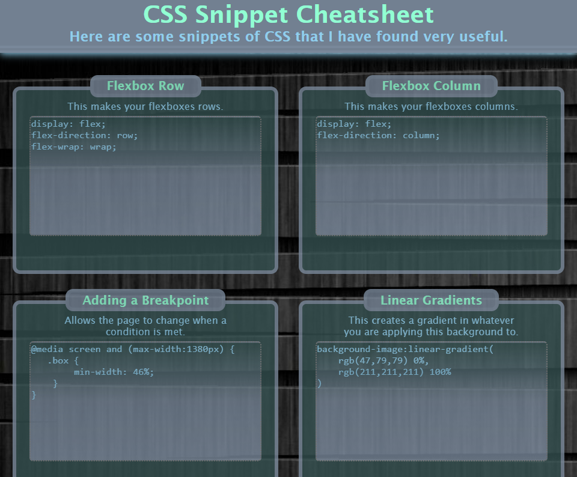
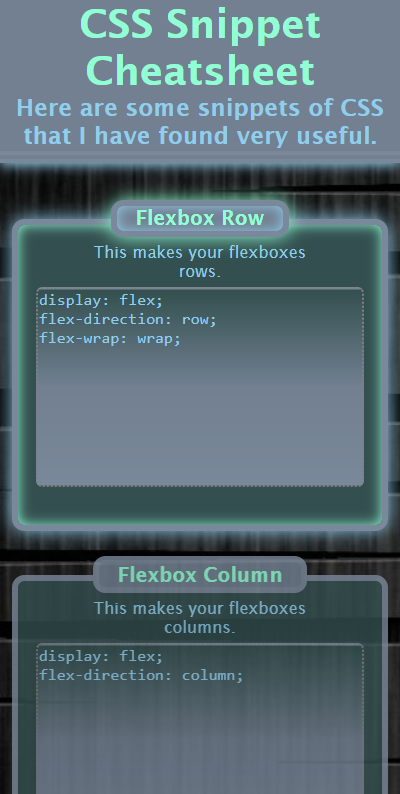

# Activity 28
## Mini-Project 2  
  
This repository contains a mini-project for UofO Coding Bootcamp. 

This is an example image of what the website looks like on different resolutions: 

> **1920p width screen example.**   
>

> **768p width screen example.**   
>

> **320p width screen example with glow.**  
>

The URL is as follows: <https://reidk361.github.io/Activity28/>

If you have any recommendations or comments, please message me on Slack. 